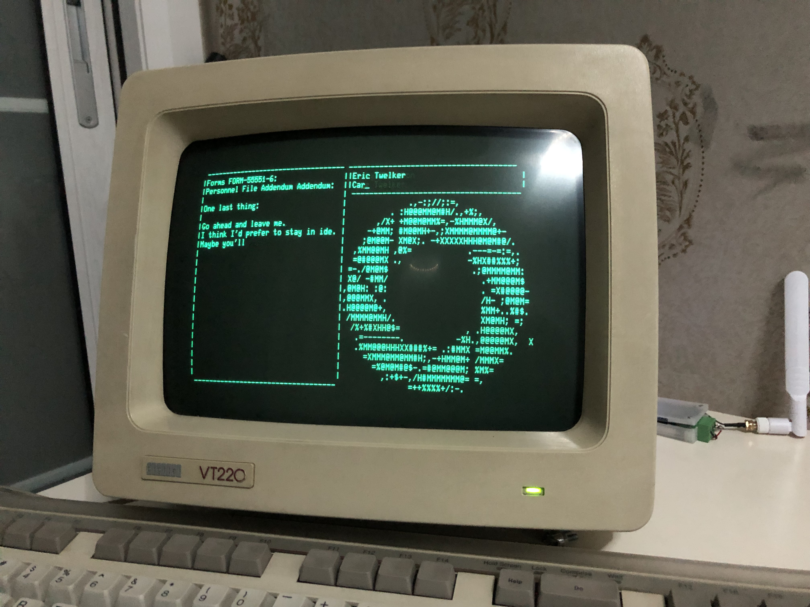

## Portal_Still_Alive_Rust
 - this TUI program is for recreate **final sence** (a Command-line User Interface with beautiful music playing~) of [Portal: Still Alive](https://theportalwiki.com).
 - single excutable program compile and distrobute by github CI,very simple to use and secure.
 - Compability for main-stream terminals (powershell/kitty/gnomeshell/etc)
 - Even compability with old REAL TTY dumb terminal! (VT100,VT220/etc)

## Hardware support
Depend on sound output capability, until now, the project is supporting Linux,Window,MacOS for variant of CPU architecture.
You can manually compile it to any OS if Rust Programming Language support it, but it require advanced rust knowladge to deal with dependency and compile error ;)

## Idea
 - This program inspire by project [Portal_Still_Alive_Python](https://github.com/errorer/Portal_StillAlive_Python), but python envoriment is not easy to setup and don't give good compability, so i create this program.

## Arguments
| Argument         | Short | Description                                                                                  | Values                                             |
|------------------|-------|----------------------------------------------------------------------------------------------|----------------------------------------------------|
| --version        | -v    | Check Program version                                         | none                                 |
| --mute-music       | -M    | Don't play music on background | none |

## How to use
- Download the version of program fit your CPU architectrue and operating system on [Github Release](https://github.com/jindongjie/Portal_StillAlive_Rust/releases).
- run the excutable program on your terminal.
- enjoy!

